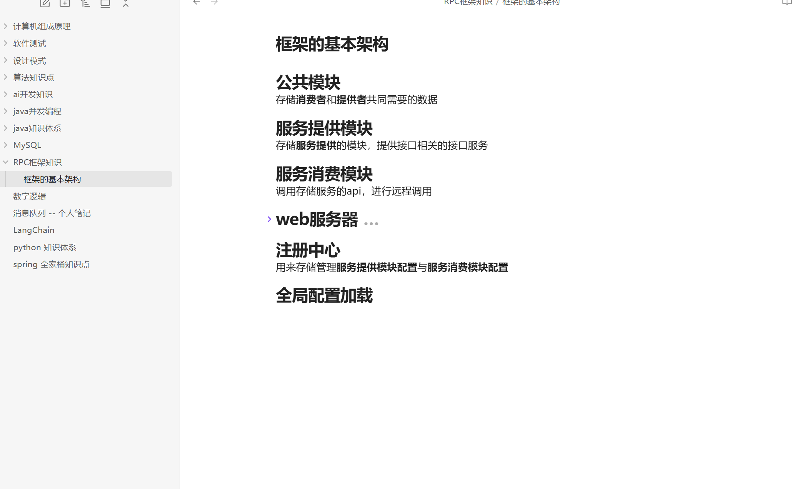

# 公共模块
存储**消费者**和**提供者**共同需要的数据
# 服务提供模块
存储**服务提供**的模块，提供接口相关的接口服务
# 服务消费模块
调用存储服务的api，进行远程调用
# web服务器
用来跑**服务提供模块的代码**
 * 提供服务处理调用 - 请求处理器
 * 消费服务发送请求 
    * 静态代理
    * 
# 注册中心
用来存储管理**服务提供模块配置**与**服务消费模块配置**
# 全局配置加载
