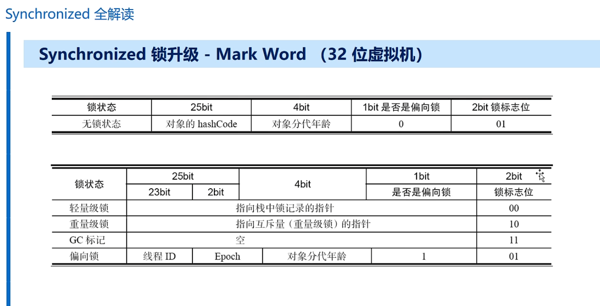

# synchronized 的三种使用方式

## **同步实例方法**

作用于当前实例，进入方法前需要获得**当前实例的锁**
```java
public class Counter {
    private int count = 0;
    
    // 同步实例方法
    public synchronized void increment() {
        count++;
    }
    
    public synchronized int getCount() {
        return count;
    }
}
```
## **同步静态方法**

作用于当前类，进入方法前需要获得**当前类的Class对象锁**
```java
public class StaticCounter {
    private static int count = 0;
    
    // 同步静态方法
    public static synchronized void increment() {
        count++;
    }
    
    public static synchronized int getCount() {
        return count;
    }
}
```

##  **同步代码块**

更细粒度的控制，可以指定锁对象
```java
public class FineGrainedLock {
    private int count1 = 0;
    private int count2 = 0;
    private final Object lock1 = new Object();
    private final Object lock2 = new Object();
    
    public void increment1() {
        // 只同步必要的代码
        synchronized(lock1) {
            count1++;
        }
    }
    
    public void increment2() {
        synchronized(lock2) {
            count2++;
        }
    }
}
```
# 四大核心特性

### **有序性**

**含义**：确保指令执行顺序的一致性，防止指令重排序

**具体表现**：
```java
public class OrderExample {
    private int x = 0;
    private boolean flag = false;
    
    public synchronized void writer() {
        x = 42;          // 1
        flag = true;     // 2 - 在同步块内不会被重排序到1之前
    }
    
    public synchronized void reader() {
        if (flag) {
            System.out.println(x);  // 总能读到42
        }
    }
}
```
**四种互斥情况**：

- **读读**：非互斥（无数据竞争）
    
- **读写**：互斥（防止读到中间状态）
    
- **写写**：互斥（防止数据覆盖）
    
- **写读**：互斥（保证读到最新值）
    

###  **可见性**

**原理机制**：

1. **获取锁时**：JMM（Java内存模型）会将工作内存中的共享变量失效，强制从主内存重新读取
    
2. **释放锁时**：JMM会将工作内存中的共享变量刷新到主内存
```java
public class VisibilityExample {
    private int count = 0;  // 不使用volatile
    
    public synchronized void increment() {
        count++;  // 1.从主内存读取最新值
                  // 2.在工作内存中递增
                  // 3.释放锁时刷新到主内存
    }
    
    public synchronized int getCount() {
        return count;  // 获取锁时从主内存读取最新值
    }
}
```
**与volatile的区别**：

|特性|synchronized|volatile|
|---|---|---|
|可见性保证|✅|✅|
|原子性保证|✅（复合操作）|❌（仅单次读/写）|
|互斥访问|✅|❌|
|性能开销|较高|较低|

### **原子性**

**实现原理**：通过线程互斥确保代码块不可分割
```java
public class AtomicityExample {
    private int balance = 100;
    
    // 非原子操作的问题
    public void unsafeWithdraw(int amount) {
        if (balance >= amount) {
            // 这里可能被其他线程中断
            balance -= amount;
        }
    }
    
    // synchronized保证原子性
    public synchronized void safeWithdraw(int amount) {
        if (balance >= amount) {
            balance -= amount;  // 检查和扣款是一个原子操作
        }
    }
    
    // 复合操作的原子性
    public synchronized void transfer(AtomicityExample to, int amount) {
        this.balance -= amount;
        to.balance += amount;  // 两个操作作为一个原子单元
    }
}
```
### **可重入性**

**定义**：同一线程可以重复获取同一把锁
```java
// ThreadReln.java 示例扩展
public class ReentrantExample {
    public synchronized void method1() {
        System.out.println("进入method1");
        method2();  // 可重入：当前线程已持有锁，可以再次进入同步方法
        System.out.println("离开method1");
    }
    
    public synchronized void method2() {
        System.out.println("进入method2");
        // 不需要重新获取锁
    }
}

// 验证可重入性的测试
class ReentrantTest {
    public static void main(String[] args) {
        ReentrantExample example = new ReentrantExample();
        
        Thread t = new Thread(() -> {
            example.method1();  // 可以嵌套调用同步方法
        });
        t.start();
    }
}
```
**可重入实现原理**：
```java
// 伪代码展示锁的实现
class Monitor {
    int count = 0;      // 重入次数计数器
    Thread owner = null;// 锁持有者
    
    void enter() {
        Thread current = Thread.currentThread();
        if (owner == current) {
            count++;  // 重入：增加计数
            return;
        }
        // 否则竞争锁...
    }
    
    void exit() {
        if (owner != Thread.currentThread()) {
            throw new IllegalMonitorStateException();
        }
        count--;
        if (count == 0) {
            owner = null;  // 完全释放锁
            // 唤醒等待线程
        }
    }
}
```
## 二、内存语义与实现原理

## **内存屏障（Memory Barrier）**

synchronized通过插入内存屏障保证可见性和有序性：
```java
public class MemoryBarrierExample {
    // synchronized相当于以下屏障组合：
    // 加锁时：LoadLoad + LoadStore 屏障
    // 释放锁时：StoreStore + StoreLoad 屏障
    
    private int x, y;
    private boolean ready;
    
    public void writer() {
        x = 1;
        y = 2;
        synchronized(this) {
            ready = true;  // StoreStore屏障：保证x=1,y=2先写入内存
        }
        // StoreLoad屏障：保证ready=true对所有线程可见
    }
    
    public void reader() {
        synchronized(this) {
            if (ready) {  // LoadLoad屏障：保证从内存读取最新值
                // LoadStore屏障：防止后续指令重排序
                int r1 = x;
                int r2 = y;
            }
        }
    }
}
```
### **锁升级过程**

现代JVM的锁优化：

无锁 → 偏向锁 → 轻量级锁 → 重量级锁

- **偏向锁**：单线程访问时的优化
    
- **轻量级锁**：多线程轻度竞争时的优化
    
- **重量级锁**：真正互斥，涉及操作系统互斥量
    

## 实际应用要点

### **正确使用模式**
```java
// 模式1：保护共享变量
public class SharedResource {
    private final Object lock = new Object();
    private int sharedData;
    
    public void updateData(int newValue) {
        synchronized(lock) {
            sharedData = newValue;
            // 其他相关操作...
        }
    }
}

// 模式2：保护复合操作
public class Account {
    private double balance;
    
    // 保证检查和更新的原子性
    public boolean withdraw(double amount) {
        synchronized(this) {
            if (balance >= amount) {
                balance -= amount;
                return true;
            }
            return false;
        }
    }
}
```
### **注意事项**
```java
public class CommonMistakes {
    // 错误1：锁对象被改变
    private Object lock = new Object();
    public void mistake1() {
        synchronized(lock) {
            lock = new Object();  // 错误！锁对象被改变
        }
    }
    
    // 错误2：字符串字面量作为锁（危险）
    public void mistake2() {
        synchronized("LOCK") {  // 字符串字面量全局共享！
            // 可能与其他代码意外互斥
        }
    }
    
    // 正确做法：使用private final对象
    private final Object safeLock = new Object();
    public void correctMethod() {
        synchronized(safeLock) {
            // 安全操作
        }
    }
}
```
# synchronized 锁升级机制
## 锁-MarkWord的结构图


 有两个注意的点 就是**偏向锁状态** 和 **无锁状态** 锁标志位是相同的，但是**无锁状态**这个偏向锁标志
 是 **0** 而 **偏向锁状态** 这个偏向锁的标志是**1**
#  锁的四种状态（从低到高）
### 1. **无锁状态**

- 对象刚创建时的初始状态
    
- 没有线程竞争
    

### 2. **偏向锁**

- **目的**：优化只有一个线程访问同步块的场景
    
- **原理**：当线程第一次获得锁时，会在对象头中记录线程ID
    
- **后续**：同一线程再次进入时无需任何同步操作
    
- **特点**：加锁和解锁不需要CAS操作，性能开销极小
    

### 3. **轻量级锁**

- **触发条件**：当有第二个线程尝试获取锁（发生竞争）
    
- **原理**：
    
    - 线程在自己的栈帧中创建锁记录（Lock Record）
        
    - 使用CAS尝试将对象头中的Mark Word替换为指向锁记录的指针
        
    - 成功则获取锁，失败则自旋尝试
        
- **自旋策略**：线程不会立即阻塞，而是循环尝试获取锁
    
- **适用场景**：线程竞争不激烈，同步块执行时间短
    

### 4. **重量级锁**

- **触发条件**：
    
    - 轻量级锁自旋超过一定次数（默认10次，可通过 `-XX:PreBlockSpin` 调整）
        
    - 等待线程数超过CPU核心数的一半
        
- **原理**：
    
    - 向操作系统申请互斥量（mutex）
        
    - 未获取锁的线程会被挂起（进入阻塞状态）
        
    - 线程调度涉及用户态到内核态的切换，开销较大
        
- **特点**：真正的互斥锁，保障线程安全但性能开销大
# 偏向锁的深究
## 偏向锁的启用条件

### 1. **JDK版本要求**

- **至少JDK 1.6**版本（Java 6及以上）
    
- Java 6和Java 7中**默认启用**偏向锁
### 2. **JVM参数配置**

- **启动延迟**：偏向锁在应用启动几秒后才激活
    
    - 可关闭延迟：`-XX:BiasedLockingStartupDelay=0`
        
- **完全关闭**：如果应用锁通常处于竞争状态
    
    - `-XX:UseBiasedLocking=false` → 直接进入轻量级锁
### 3. **关键限制条件**

- **对象不能调用hashCode()方法**
    
    - 一旦调用，对象头会存储真正的hashCode值
        
    - **原因**：偏向锁的Mark Word没有地方保存hashCode
        
    - 只有轻量级锁才有"displaced mark word"来保存原始Mark Word
        

## 偏向锁的工作原理

### 1. **首次获取锁**

text

线程首次进入同步块时：
1. 对象头(Mark Word)存储线程ID
2. 栈帧中的锁记录(Lock Record)也存储线程ID

### 2. **后续访问**

text

同一线程再次进入同步块：
1. 检查对象头中的线程ID是否匹配当前线程
2. 如果匹配 → 直接获得锁（无CAS操作）
3. 性能开销极小

### 3. **竞争发生时的处理**

当其他线程尝试获取锁时：

1. **检查偏向锁标识**
    
    - 如果未设置偏向锁标识 → 使用CAS竞争锁
        
    - 如果已设置偏向锁标识 → 尝试CAS替换线程ID
# 偏向锁的竞争升级场景

### 场景1：A线程死亡后，B线程争抢

条件：A线程获取偏向锁 → A线程死亡退出 → B线程争抢
结果：直接升级为轻量级锁
特点：只争抢一次就升级
### 场景2：A线程持有锁时，B线程争抢

条件：A线程获取偏向锁 → A线程未释放锁（在同步块内） → B线程争抢
结果：直接升级为重量级锁
特点：最严重的情况，直接跳到最高级别
### 场景3：A线程释放锁后，B线程争抢

条件：A线程获取偏向锁 → A线程释放锁（仍活跃） → B线程争抢
结果：升级为轻量级锁
特点：有序竞争，逐步升级
## 升级规则总结表

| A线程状态   | B线程争抢时机 | 升级结果   |
| ------- | ------- | ------ |
| **已死亡** | 死亡后争抢   | → 轻量级锁 |
| **持有锁** | 同步块内争抢  | → 重量级锁 |
| **释放锁** | 释放后争抢   | → 轻量级锁 |

## 关键概念澄清

### 1. **关于"锁降级"的误解**

误解示例：
A持有偏向锁 → B多次争抢 → 升级为重量级锁
↓
锁释放后 → 对象回到轻量级锁初始状态

正确理解：
这不是锁降级！锁升级是在"线程运行和争抢过程中"发生的。
锁释放后对象状态重置，不是运行中的降级过程。
### 2. **锁升级的本质**

- **运行时行为**：在**线程竞争过程中**发生的状态提升
    
- **不可逆性**：一旦升级到更高级别，在当前竞争周期内不会降级
    
- **重置性**：锁释放后，对象状态可重置，但这**不是降级**

## 特殊情况分析

### 场景4：部分争抢保持偏向锁

条件：A释放锁后仍活跃 → B线程争抢
结果：部分情况保持偏向锁，部分升级轻量级锁

原因：JVM的优化策略，根据竞争激烈程度动态调整
## 重要结论

1. **锁升级是单向的**：在竞争过程中只有升级，没有降级
    
2. **状态重置≠降级**：锁释放后的状态重置不是运行时的降级
    
3. **竞争激烈度决定升级幅度**：
    
    - 温和竞争 → 轻量级锁
        
    - 激烈竞争 → 重量级锁
        
4. **持有者状态是关键**：原偏向锁持有者的状态直接影响升级路径
