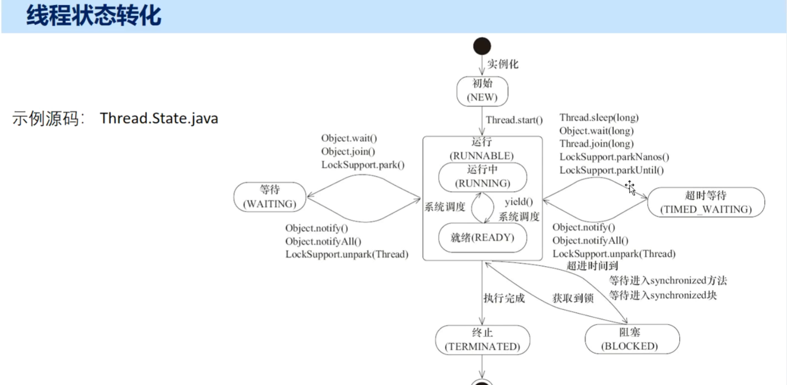

# 线程状态转换图

# 状态的具体介绍
## **1. NEW（新建状态）**

**线程刚被创建，但尚未启动**

java

Thread thread = new Thread(() -> {
    System.out.println("线程执行");
});
System.out.println(thread.getState());  // NEW
System.out.println(thread.isAlive());   // false

**特点：**

- 线程对象已创建，但未调用 `start()` 方法
    
- 不会执行任何代码
    
- `isAlive()` 返回 `false`
    

## **2. RUNNABLE（可运行状态）**

**线程正在 JVM 中执行，但不一定占用 CPU**

```java
Thread thread = new Thread(() -> {
    System.out.println("线程状态: " + Thread.currentThread().getState());  // RUNNABLE
});
thread.start();
```
**包含两种情况：**

- **READY**：就绪状态，等待 CPU 调度
    
- **RUNNING**：正在运行，占用 CPU 执行
```java
Thread thread = new Thread(() -> {
    while (true) {
        // 可能处于 READY 或 RUNNING 状态
    }
});
thread.start();
```
## **3. BLOCKED（阻塞状态）**

**线程等待获取一个排他锁（synchronized）**

```java
public class BlockedExample {
    private static final Object lock = new Object();
    
    public static void main(String[] args) throws InterruptedException {
        Thread t1 = new Thread(() -> {
            synchronized (lock) {
                try {
                    Thread.sleep(5000);  // 持有锁5秒
                } catch (InterruptedException e) {
                    e.printStackTrace();
                }
            }
        });
        
        Thread t2 = new Thread(() -> {
            synchronized (lock) {  // 等待锁
                System.out.println("t2获取到锁");
            }
        });
        
        t1.start();
        Thread.sleep(100);  // 确保t1先获取锁
        t2.start();
        
        Thread.sleep(100);
        System.out.println("t2状态: " + t2.getState());  // BLOCKED
    }
}
```
## **4. WAITING（等待状态）**

**线程等待另一个线程的特定动作（通知/中断）**

```java
public class WaitingExample {
    public static void main(String[] args) throws InterruptedException {
        Object monitor = new Object();
        
        Thread t = new Thread(() -> {
            synchronized (monitor) {
                try {
                    monitor.wait();  // 进入WAITING状态
                } catch (InterruptedException e) {
                    e.printStackTrace();
                }
            }
        });
        
        t.start();
        Thread.sleep(100);
        System.out.println("线程状态: " + t.getState());  // WAITING
        
        synchronized (monitor) {
            monitor.notify();  // 唤醒线程
        }
    }
}
```
**进入 WAITING 的方法：**

- `Object.wait()`
    
- `Thread.join()`
    
- `LockSupport.park()`
## **5. TIMED_WAITING（计时等待状态）**

**线程在指定的时间内等待**

```java
public class TimedWaitingExample {
    public static void main(String[] args) throws InterruptedException {
        Thread t = new Thread(() -> {
            try {
                Thread.sleep(5000);  // 睡眠5秒
            } catch (InterruptedException e) {
                e.printStackTrace();
            }
        });
        
        t.start();
        Thread.sleep(100);
        System.out.println("线程状态: " + t.getState());  // TIMED_WAITING
    }
}
```
**进入 TIMED_WAITING 的方法：**
- `Thread.sleep(millis)`
    
- `Object.wait(timeout)`
    
- `Thread.join(timeout)`
    
- `LockSupport.parkNanos()`
    
- `LockSupport.parkUntil()`
## **6. TERMINATED（终止状态）**

**线程执行完毕或异常终止**

```java
public class TerminatedExample {
    public static void main(String[] args) throws InterruptedException {
        Thread t = new Thread(() -> {
            System.out.println("线程执行完毕");
        });
        
        System.out.println("启动前: " + t.getState());  // NEW
        
        t.start();
        Thread.sleep(100);
        
        System.out.println("启动后: " + t.getState());  // TERMINATED
        System.out.println("是否存活: " + t.isAlive());   // false
    }
}
```

**终止的原因：**

- 正常执行完成
    
- 抛出未捕获的异常
    
- 被其他线程中断